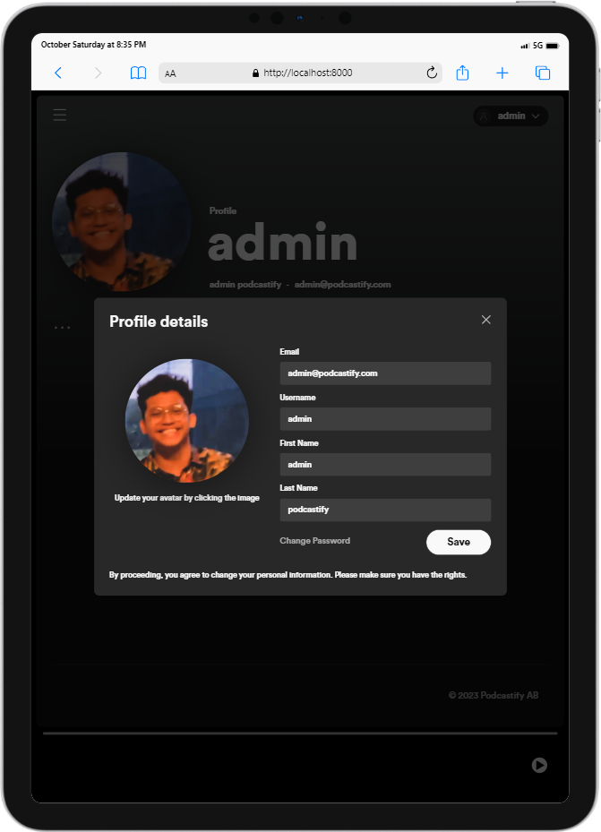
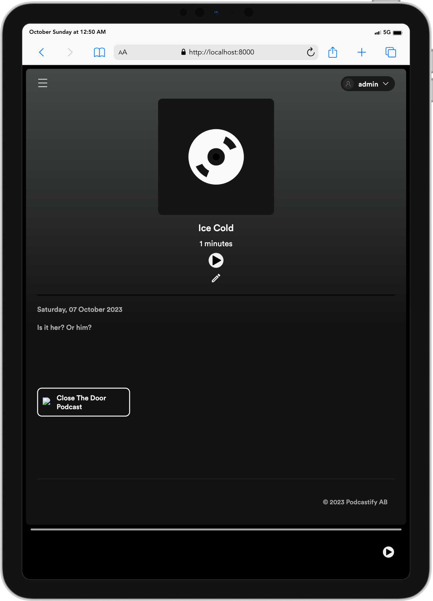

# Podcastify - Your Daily Podcast App
Podcastify is your go-to application for daily podcasts. With a simple and intuitive interface, it allows you to listen to your favorite podcasts anytime, anywhere.

## Functionality
1. <b>Recommendation Podcasts</b>: The homepage features recommended podcasts, providing users with a curated list of popular and trending podcasts.
2. <b>Search Functionality</b>: Users can search through a vast library of podcasts to find their favorite ones or discover new ones.
3. <b>Podcast Player</b>: Each episode of the chosen podcast can be listened to directly within the app, providing a seamless listening experience.
4. <b>Admin Panel</b>: Administrators have the ability to manage podcasts, episodes, and users, ensuring the content is up-to-date and the user experience is optimized.

## Tech Stacks
Podcastify is built using the following technologies:

* <b>HTML/CSS/JS</b>: The frontend of the application is built with pure HTML, CSS, and JavaScript, ensuring a lightweight and responsive user interface.
* <b>PHP</b>: PHP is used on the backend for server-side scripting, providing robust and secure functionality.
* <b>Docker</b>: The application and its database are containerized using Docker, ensuring easy setup, deployment, and distribution.
* <b>Docker Compose</b>: Docker Compose is used to manage the application services, allowing the app and database to be run together seamlessly.

## How to Get Started
1. Clone this repository
2. Copy the `.env.example` file and rename it to `.env`:
```bash
    cp .env.example .env
```
3. Open the `.env` file and replace the placeholder values with your actual data.
4. On the root of this project, run the following commands:
```bash
    docker build -t tubes-1:latest .

    docker-compose up -d --build
```
5. To shut down the app, run
```bash
    docker-compose down
```
6. Ensure that the Docker Daemon is running

## Tasking

|              Name              |   NIM    | Client Side | Server Side |
| :----------------------------: | :------: | :---------: | :---------: |
| Muhammad Bangkit Dwi Cahyono   | 13521055 |             |             |
| Irsyad Nurwidianto Basuki      | 13521072 |             |             |
| Jimly Firdaus                  | 13521102 |             |             |

## Responsive Layouts & Lighthouse
<div align="center">
    <h1>Responsive Layouts</h1>
    
    
    
    <p align="center"><em>Login Page</em></p>
    </br>
    
    
    
    <p align="center"><em>Sign Up Page</em></p>
    <br/>
    
    
    
    <p align="center"><em>Home Page</em></p>
    <br/>
    
    
    
    
    
    
    <p align="center"><em>Profile Page</em></p>
    <br/>
    
    
    
    <p align="center"><em>User List Page</em></p>
    <br/>
    
    
    
    
    
    
    
    
    
    
    
    
    <p align="center"><em>Podcast Page</em></p>
    <br/>
    
    
    
    
    
    
    
    
    
    
    
    
    <p align="center"><em>Episode Page</em></p>
    <br/>
    
    
    
    <p align="center"><em>Error Page</em></p>
    <br/>
    <h1>Lighthouse</h1>
    
    <p align="center"><em>Login Page</em></p>
    <br/>
    
    <p align="center"><em>Sign Up Page</em></p>
    <br/>
    
    <p align="center"><em>Home Page</em></p>
    <br/>
    
    <p align="center"><em>Profile Page</em></p>
    <br/>
    
    <p align="center"><em>User List Page</em></p>
    <br/>
    
    
    
    
    <p align="center"><em>Podcast Page</em></p>
    <br/>
    
    
    
    
    <p align="center"><em>Episode Page</em></p>
    <br/>
    
    <p align="center"><em>Error Page</em></p>
    <br/>
</b>
</div>
