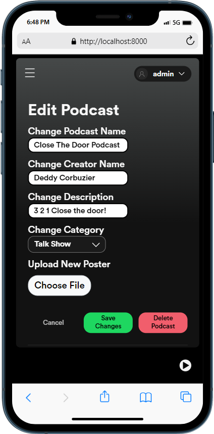

# Podcastify - Your Daily Podcast App

|              Name              |   NIM    |
| :----------------------------: | :------: |
| Muhammad Bangkit Dwi Cahyono   | 13521055 |
| Irsyad Nurwidianto Basuki      | 13521072 |
| Jimly Firdaus                  | 13521102 |

## Functionality

## Tech Stacks

## How to Get Started

## Tasks

## Responsive Layouts & Lighthouse

    <h1>Responsive Layouts</h1>
    
    
    
    
<em>Login Page</em>

     
    
    
    
    
<em>Sign Up Page</em>

     
    
    
    
    
<em>Home Page</em>

     
    
    
    
    
    
    
    
    
    
    
    
    
    
<em>Podcast Page</em>

    <h1>Lighthouse</h1>
    
    
<em>Home Page</em>

    
    
    
    
    
<em>Podcast Page</em>

</b>

